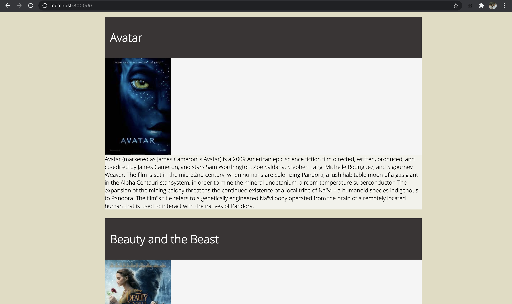
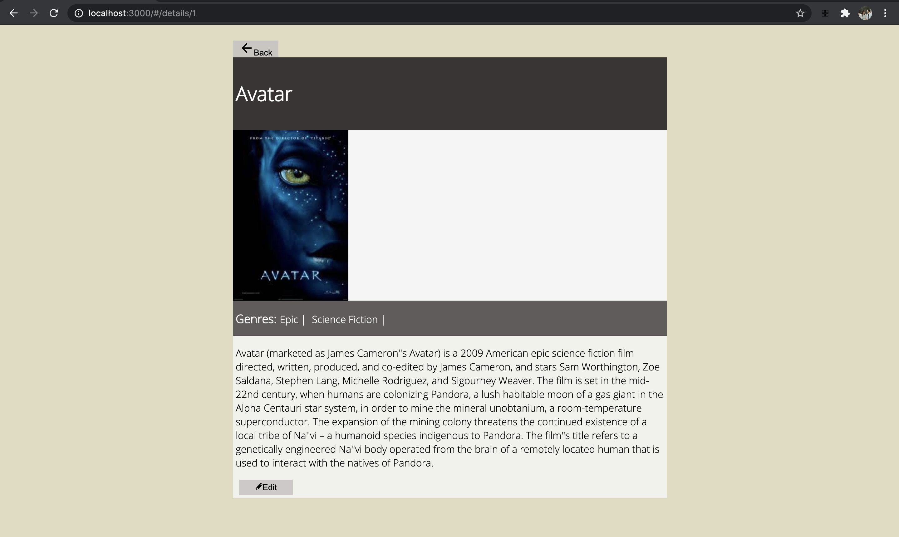
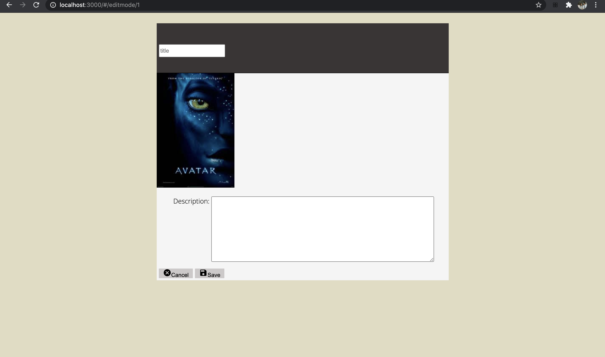

# Movie Database

## Description

2 Day Sprint (WIP)

A list of movies displayed on a home page. Clicking on the movie poster image will display details of the movies and give the user options to edit and update the details of the movie selected.

## Screen Shot

### Prerequisites

- [React.js](https://reactjs.org)
- [Node.js](https://nodejs.org/en/)
- [PostgreSQL](https://www.postgresql.org)

## Installation

1. Create a database named `saga_movies_weekend`,
2. The queries in the `database.sql` file are set up to create all the necessary tables and populate the needed data to allow the application to run correctly. The project is built on [Postgres](https://www.postgresql.org/download/), so you will need to make sure to have that installed. We recommend using Postico to run those queries as that was used to create the queries,
3. Open up your editor of choice and run an `npm install`
4. Run `npm run server` in your terminal
5. Run `npm run client` in your terminal
6. The `npm run client` command will open up a new browser tab for you!

## Usage

1. Open the client and look through the movies.

## Built With

List technologies and frameworks here

## License

[MIT](https://choosealicense.com/licenses/mit/)

_Note, include this only if you have a license file. GitHub will generate one for you if you want!_

## Acknowledgement

Thanks to [Prime Digital Academy](www.primeacademy.io) who equipped and helped me to make this application a reality. (Thank your people)

## Support

If you have suggestions or issues, please email me at [youremail@whatever.com](www.google.com)
